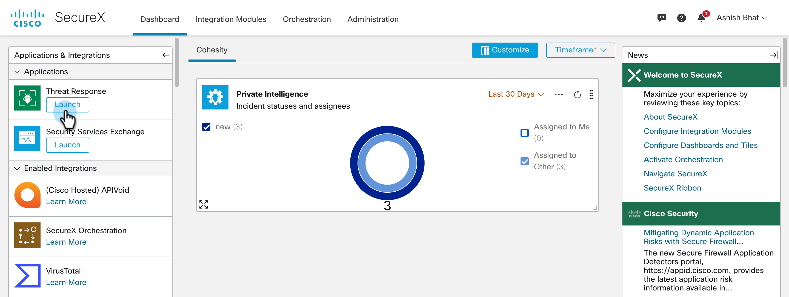
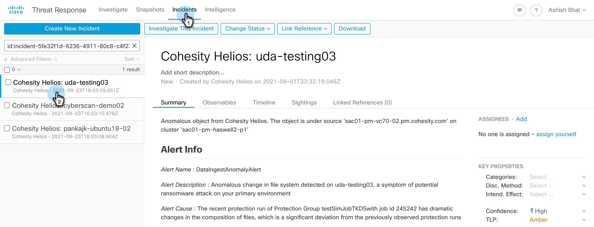

# Table of contents :scroll:

 - [Intro](#intro)
 - [Pre-requisites](#pre-req)
    * [Create SecureX API Client](#securex-client)
    * [Create Cohesity Helios API Key](#helios-client)
    * [Set Variables](#set-variables)
 - [How to Run](#run)
 - [Input to this workflow](#input)
 - [Output for workflow](#output)
 - [What's Next!](#next)

###  Cohesity Restore Anomalous Object
[home](../../README.md)

This workflow restores the specified anomalous object to the latest clean snapshot. It also resolves the alert on helios once the restore task is triggered. The restored VM name will in the format Recover-{original VM name}-VM-{epoch timestamp when the vm is restored} and the restore task name on the cluster will be in format Cisco_SecureX_triggered_restore_task_{object name}. These variables should be set for before you try and run this workflow. Below is the list of variables that you need to set with their description.  

> NOTE: This is an Response workflow and you will NOT run this workflow directly. This will run from Cisco Threat Response under incident. Please check the [How to Run section](#run) to know more. 

###  Pre-requisites

Before you can run this workflow, there are a certain pre-req that you need to configure. Lets go over all of them and make sure they are set to get started. Most of the steps are common between all the workflows, so once you set configure these, you will be able to easily configure and run other workflows :)

####  Create SecureX API Client
[top](#Cisco-SecureX-Integration)

You will need to create SecureX API Client and get the Client ID and Client Password to run all the workflows. Refer to the [Create SecureX API Client document](../misc/CreateSecureXAPIClient.md) to generate it. 

####  Create Cohesity Helios API Key
[top](#Cisco-SecureX-Integration)

In order to run the workflow on SecureX, you need to pass Helios APIKey. To create it, login to Cohesty Helios and [create the APIKey.](https://developer.cohesity.com/docs/helios-getting-started)

####  Set Variables

This workflow expects a bunch of variables that are needed to make a bunch of API calls like restoring anomalous objects on Cohesity Helios and resolve the Incident on SecureX. These variables should be set for before you try and run this workflow. Below is the list of variables that you need to set with their description.  

| **Argument Name** | **Type** | **Description** | **Required** |
| --- | --- |--- | --- |
| APIClientID | Secure String | Threat Response API Client ID | Yes | 
| APIClientPassword | Secure String | Threat Response API Client Password | Yes | 
| HeliosAPIKey | Secure String | API Key to access Helios | Yes | 
| DeleteSightingIncident  | String | Specifies where to delete or not the sighting once the anomaly is ignored. Can be `yes` or `no`.| No. Default is `No` | 

In order to set this variables, check the [Set Variables document](../misc/SetVariables.md). 

>NOTE: There are other 2 variable that this workflow uses named `observable_value` and `observable_type` but that is set directly when you [run](#run) the workflow.  

###  How to Run
[home](../../README.md)

Once you have performed all the [pre-req](#pre-req) for this workflow, this workflow can be executed from Threat Response for the Incident there shown below. 

> NOTE: You will need to run the [Cohesity Helios Ransomware Alerts to Threat Response and ServiceNow](./HeliosRansomwareAlertsToThreatResponseAndServiceNow.md) workflow to see the SecureX incident for Cohesity Helios Anomalous object alert.

1. Login to SecureX and navigate to Threat Response

    

2. Navigate to Incident and select the Incident for Cohesity Helios Anomalous object. 

    

3. Under Observable, click the dropdown for the hostname and select `Cohesity Restore Anomalous Object`

    

4. This will trigger the `Cohesity Restore Anomalous Object` workflow and pass the `observable_value` and `observable_type` to the workflow as the `VM_NAME_VALUE` and `string` respectively. 

>NOTE: You will see the `Cohesity Restore Anomalous Object` on other Incidents too but you cannot run it there as it will fail for Incidents that are not created by Cohesity workflows. 

###   Input
[home](../../README.md)

Input to these workflows can be referred to under [Set Variables](#set-variables) section

###   Output

N/A

###  What's Next!
[home](../../README.md)

After you have executed this workflow, the anomalous objects reported by Cohesity Helios will be pushed into SecureX Threat Response as Incidents and you can perform 2 operations on these Incidents. They are,

1. [Restore to Object to latest known safe snapshot](./CohesityRestoreAnomalousObject.md)