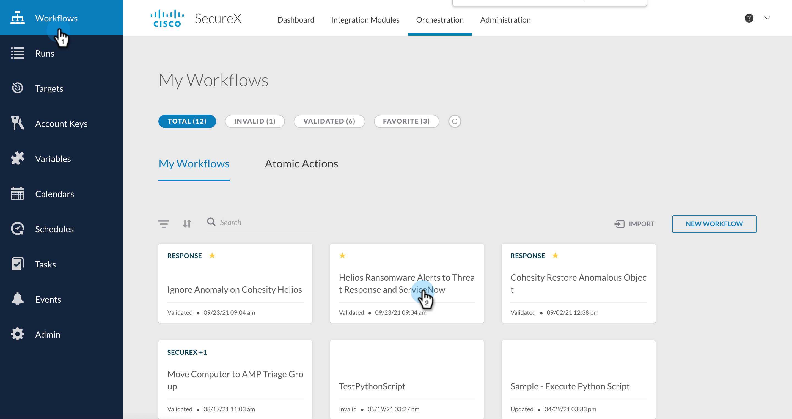

## Table of contents :scroll:

 - [Intro](#intro)
 - [Pre-requisites](#pre-req)
    * [Create SecureX API Client](#securex-client)
    * [Create Cohesity Helios API Key](#helios-client)
    * [Set Variables](#set-variables)
    * [Create Schedule](#create-schedule)
    * [Create ServiceNow Credentials](#create-snow-cred)
    * [Create ServiceNow Target](#create-snow-target)
 - [How to Run](#run)
 - [Input to this workflow](#input)
 - [Output for workflow](#output)
 - [What's Next!](#next)

###  Helios Ransomware Alerts to Threat Response and ServiceNow 
[home](../../README.md)

This workflow pushes Cohesity Helios ransomware alerts to Threat Response Private Intelligence data store, creates SecureX Incidents, Sightings and a Relationship between them. It also creates incidents on ServiceNow at regular intervals based on the schedule you define. 

This workflow has to be triggered on a schedule and user has to create `Cohesity Helios Ransomware Data Push Schedule` for this to work which is a schedule to trigger orchestration workflow to push Helios ransomware data to private intelligence.

> Note: This workflow also needs creation of 'ServiceNow_Credentials' under Account Keys and 'Cohesity_ServiceNow_Target' under Targets. These are needed for creating incidents on service now.

###  Pre-requisites
[home](../../README.md)

Before you can run this workflow, there are a certain pre-req that you need to configure. Lets go over all of them and make sure they are set to get started. Most of the steps are common between all the workflows, so once you set configure these, you will be able to easily configure and run other workflows :)

####  Create SecureX API Client

You will need to create SecureX API Client and get the Client ID and Client Password to run all the workflows. Refer to the [Create SecureX API Client document](../misc/CreateSecureXAPIClient.md) to generate it. 

####  Create Cohesity Helios API Key

In order to run the workflow on SecureX, you need to pass Helios APIKey. To create it, login to Cohesty Helios and [create the APIKey.](https://developer.cohesity.com/docs/helios-getting-started)

####  Set Variables

This workflow expects a bunch of variables that are needed to make a bunch of API calls like getting anomalous objects from Cohesity Helios and creating Incidents on SecureX. These variables should be set for before you try and run this workflow. Below is the list of variables that you need to set with their description.  

| **Argument Name** | **Type** | **Description** | **Required** |
| --- | --- |--- | --- |
| APIClientID | Secure String | Threat Response API Client ID | Yes | 
| APIClientPassword | Secure String | Threat Response API Client Password | Yes | 
| HeliosAPIKey | Secure String | API Key to access Helios | Yes | 
| HeliosRansomwareAlertsFilter  | String | Number of hours, used to get anomalous objects detected in the last `N` hours| No. Default is `1000` | 
| CreateServiceNowIncidents | String | Set this variable to `yes` or `no` based on which ServiceNow incidents will be created | No. Default is `Yes` | 

In order to set this variables, check the [Set Variables document](../misc/SetVariables.md). Now let's move the next pre-req.

####  Create Schedule

Once the variables are set, you need to create a Schedule on SecureX. This schedule will define the cadence of this workflow. For example you would want to run this workflow everyday at 9 PM PST. In that case, you can create a Schedule for that and that will run periodically and get the list of Anomalous objects everyday so that you can take action on it. 

This workflow looks for a Schedule named `Cohesity Helios Ransomware Data Push Schedule`. Please check the [Create Schedule Document](../misc/CreateSchedule.md) to see how to create this Schedule. 

####  Create ServiceNow Credentials

One of the other pre-req for this workflow is to Create ServiceNow credentials. This is needed if you want to create ServiceNow ticket for any anomalous object that is reported by Cohesity. 

Check the Create [ServiceNow Credentials document](../misc/CreateServiceNowCredentials.md) to know how to do that. 

####  Create ServiceNow Target

The last pre-req to run this workflow is to Create ServiceNow Target. Here is where you define your ServiceNow instance details where the ServiceNow tickets will be created. 

Check the Create [ServiceNow Target document](../misc/CreateServiceNowTarget.md) to know how to do that. 

###  How to Run
[home](../../README.md)

Once you have performed all the [pre-req](#pre-req) for this workflow, you can now go ahead run this workflow. Now as mentioned before, this workflow will run using the [Schedule](#create-schedule) that we created earlier. But if you want to run this workflow ad-hoc and not wait for the schedule, you can directly run this workflow as shown below. Please make sure that all the [pre-req](#pre-req) are taken care of. 

1. Login to your SecureX account and go to Orchestration

    

2. Select Workflow from the left Nav bar

     

3. Run the workflow as shown below. 

    

###   Input

Input to these workflows can be referred to under [Set Variables](#set-variables) section

###   Output

N/A

###  What's Next!
[home](../../README.md)

After you have executed this workflow, the anomalous objects reported by Cohesity Helios will be pushed into SecureX Threat Response as Incidents and you can perform 2 operations on these Incidents. They are,

1. [Ignore Anomaly](./IgnoreAnomalyOnCohesity.md)
2. [Restore to Object to latest known safe snapshot](./CohesityRestoreAnomalousObject.md)
